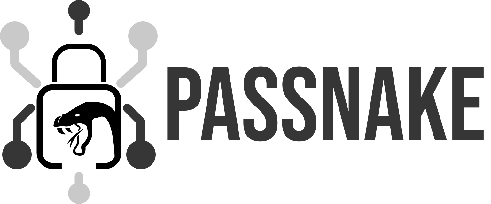

# A non-production self-hosted encrypted passwords keeper.

---
### Warning
** This project was made for self-educational purpose and there is no guarantees the project is safe to use. **  
**!! Please, do not use it on any sensitive data !!**

---

## This project uses: 
  * Python and Flask;
  * MariaDB;
  * Docker
  * RSA for encryption (Yes, it's not safe anymore) 
  * Also, it needs nginx config.

Anyway, I hope an installation guide will be here soon...
